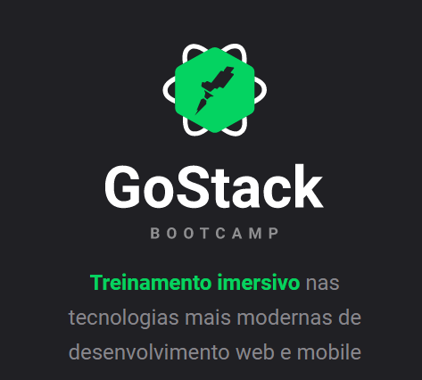
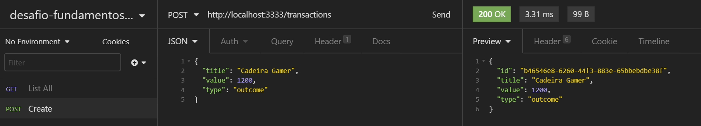
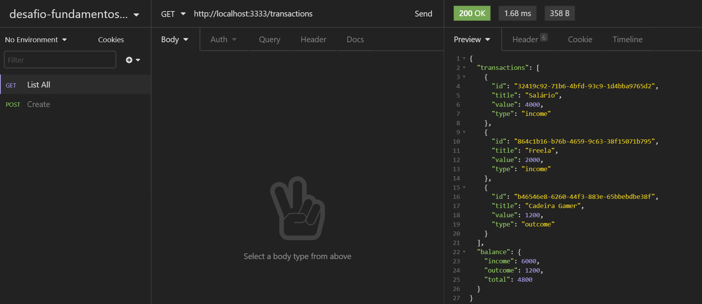

# desafio-fundamentos-node
Primeiro desafio GoStack Bootcamp - Fundamentos Node.js (nível 2)

<p align='center'>
 
</p>


## 1. Introdução

Aplicação (desafio) gerada durante a conclusão do capítulo **Node.js** do Bootcamp GoStack da **Rocketseat** que participei no ano de 2020.

<p align='center'>
 
</p>

## 2. Definições

### Objetivo

Neste desafio, foi criada uma aplicação em **Node.js** aplicando os conhecimentos obtidos até aquele momento do treinamento.


## 3. Tecnologias (Techs)

- Node.js
- Typescript

## 4. Funcionalidades

- criar transação;
- listar transações.

<p align='center'>
 
</p>

<p align='center'>
 
</p>

## 5. Instalação e execução. :octocat:

- [Clone](https://help.github.com/articles/cloning-a-repository/) o projeto na sua máquina executando o seguinte comando no seu terminal:

- Instale as dependências do projeto com o comando:

```sh
yarn
```

- Rode o projeto na sua máquina com:

```sh
yarn dev:server
```

## 6. Autoria

Este projeto foi desenvolvido por [Sandro Vieira](https://www.linkedin.com/in/vsandro) com base no template disponibilizado no treinamento.

## 7. Agradecimentos

- A todos os colegas de turma, instrutores e amigos que me acompanharam nesta jornada.
- [rocketseat](https://rocketseat.com.br/).

